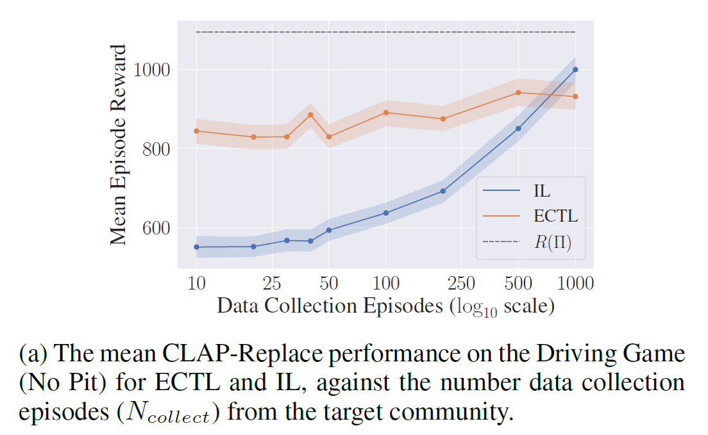
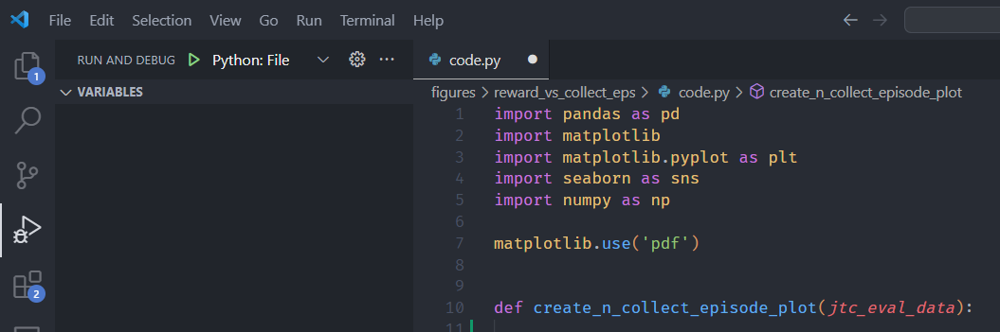

# Reproducible Figures


A small Python utility to generate easily reproducible figures for scientific papers.
I often find myself generating figures for papers and then later having to go through needlessly tedious processes to regenerate them when I want to make a small change, so I made this package.
By generating figures using this package a folder is created with the figure,
the data used to generate the figure, and the code used to generate the figure.
I recommend combining this with a version control system like git to track changes for your figures.

The reproduction code is built automatically by finding all the imports
needed for create_figure and the functions or classes
used in create_figure. This process is not flawless and can
potentially miss some imports if they are not accessible
through automated inspection. Additionally, if the code reads from
external data sources, these may not be available when
reproducing the figure. However, it should work well for most cases!

## Installation

```bash
pip install reproducible-figures
```

## Example Usage

```python
from reproducible_figures import save_reproducible_figure
import pandas as pd
import matplotlib.pyplot as plt
import numpy as np

def create_figure(data):
    fig, ax = plt.subplots()
    ax.plot(data['x'], data['y'])
    return fig

data = pd.DataFrame({
    'x': range(10),
    'y': np.random.normal(size=10)
})

save_reproducible_figure('test_save_figure', data, create_figure)
```
*Note:* The `create_figure` function must take a single argument, which is the data used to generate the figure, and should not call `plt.show`, `plt.close`, or `plt.savefig`.
If you want show the figure at the same time, you can pass the `show=True` argument to the `save_reproducible_figure` function.

```python
save_reproducible_figure('test_save_figure', data, create_figure, show=True)
```

After calling `save_reproducible_figure`, the data, figure and code will be saved to the folder `figures/test_save_figure`:

```
figures/test_save_figure
├── data.csv
├── test_save_figure.pdf
└── code.py
```

The `data.csv` file contains the data used to generate the figure, the `figure.pdf` file contains the figure itself, and the `code.py` file contains the code used to generate the figure.

In order to reproduce the figure, you can run:
```bash
python figures/test_save_figure/code.py
```

If you want to modify the figure, you can edit the `code.py` file and run it again.

## Figure Style

The function you use to create the figure can apply any stylisation you want to the figure, but the package provides a function `set_plotting_style`.
This function checks if LaTeX is available and uses it if it is.
By default, it uses the Times New Roman font for any textmode text, and Computer Modern for any mathmode text.

### Preparing and Using Figures in LaTeX Documents

To make sure that the figure looks good in a publication, you can use the `set_plotting_style` function with an appropriate figure size and font scale for your document.
I have found that a figure size of `(10, 6)` with a font scale of `2.5` works well for a single column figure in a LaTeX document with 11pt Times New Roman font. For example:

```python
from reproducible_figures import save_reproducible_figure
from reproducbile_figures.plotting import set_plotting_style
import pandas as pd
import matplotlib.pyplot as plt
import numpy as np

def create_figure(data):
    set_plotting_style(font_size=2.5)
    plt.figure(figsize=(10, 6))
    ...  # Create figure code here
    return fig

save_reproducible_figure('my_figure', data, create_figure)
```

In order to embed the figure into your document, I recommend:
```latex
\includegraphics[height=3.5cm]{figures/my_figure.pdf}
```

The following is a screenshot of an example figure created using the above parameters in a LaTeX document:

<p align="center">

</p>

Note that the text in the figure is the same font and a similar size as the text in the document.

## Advanced Usage

The `save_reproducible_figure` function should naturally be able to handle most some quite complicated code structure. For example, suppose you have the following figure generating code:

```python
import numpy as np

def external_fn(x):
    return np.sqrt(x)


class HelperClass:

    def __init__(self, a: int):
        self.a = a

    def internal_fn(self, x):
        return x * self.a

    def preprocess_data(self, data: pd.DataFrame) -> pd.DataFrame:
        """Preprocess data."""
        data['y'] = self.internal_fn(data['y'])
        data['x'] = external_fn(data['x'])
        return data


def complex_create_figure(data: pd.DataFrame):
    fig, ax = plt.subplots()
    helper_class = HelperClass(a=10)
    data = helper_class.preprocess_data(data)
    ax.plot(data['x'], data['y'])
    return fig
```


#### Additional Imports

In general, you should not need to manually specify additional imports.
However, in some cases it is unavoidable, so you can pass them to the `save_reproducible_figure` function:

```python
save_reproducible_figure('test_save_figure',
                         data,
                         create_figure,
                         additional_imports=['import networkx as nx'])
```

This will add `import networkx as nx` to the `code.py` file.
See the tests for an example using `networkx` to generate a figure.


#### Additional Functions
In most cases, this should not be needed as the automatic
source builder should find all the functions needed. However,
if there are any issues or you just want to preserve some code
(e.g. code used to generate the data), the functions provided
can be added here to be put into the source file.

If you want to use helper functions in your `code.py` file, you can pass them to the `save_reproducible_figure` function. For example:

```python
def preprocess_data(data: pd.DataFrame) -> pd.DataFrame:
    """Preprocess data."""
    data['y'] = data['y'] * 100
    return data


def create_test_figure_with_helper_fns(data: pd.DataFrame):
    """Create a figure."""
    fig, ax = plt.subplots()
    data = preprocess_data(data)
    ax.plot(data['x'], data['y'])

save_reproducible_figure('test_fig_preprocessor', data,
                         create_test_figure_with_helper_fns,
                         helper_fns=[preprocess_data])
```


### Reproducing Figures in VSCode

If you use VSCode, you can easily reproduce the figure with the `Python: File` run configuration. Select the gear icon in the "Run and Debug" tab to create a new run configuration.
Then with the `code.py` file as your active tab, select `Python: File` as the run configuration and run it. Or you can use the keyboard shortcut `F5` to run the file.

<p align="center">

</p>
